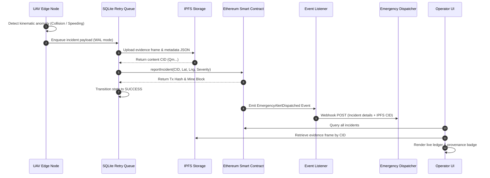

# SkyGuard UAV: System Architecture & Design Specification

## Overview

**SkyGuard UAV** is an end-to-end edge-to-blockchain intelligent transportation system designed to monitor vehicular traffic, detect anomalous traffic incidents in real-time, archive cryptographic evidence bundles on decentralized storage, and anchor immutable audit trails on an EVM-compatible blockchain.

---

## 1. 4-Tier System Architecture

```
+-----------------------------------------------------------------------------------+
|                            TIER 1: UAV EDGE NODE                                  |
|                                                                                   |
|  +-------------------+      +-------------------+      +----------------------+   |
|  | Video Feed Stream | ---> | YOLOv8n Aerial AI | ---> | ByteTrack Tracking   |   |
|  | (RTSP / Camera)   |      | (PyTorch / ONNX)  |      | (Multi-Object IDs)   |   |
|  +-------------------+      +-------------------+      +----------------------+   |
|                                                                   |               |
|                                                                   v               |
|                                                        +----------------------+   |
|                                                        | Kinematic Heuristics |   |
|                                                        | (Speed, Crash, Jam)  |   |
|                                                        +----------------------+   |
|                                                                   |               |
|                                                                   v               |
|                                                        +----------------------+   |
|                                                        | SQLite Retry Queue   |   |
|                                                        | (WAL, Offline-First) |   |
|                                                        +----------------------+   |
+-------------------------------------------------------------------+---------------+
                                                                    |
                                     +------------------------------+------------------------------+
                                     | (Incident Evidence Bundle)                                  | (On-Chain Transaction)
                                     v                                                             v
+---------------------------------------------------+     +---------------------------------------------------+
|         TIER 2: DECENTRALIZED STORAGE (IPFS)      |     |             TIER 3: BLOCKCHAIN SMART CONTRACTS    |
|                                                   |     |                                                   |
|  +---------------------------------------------+  |     |  +---------------------------------------------+  |
|  | IPFS Client Driver                          |  |     |  | TrafficIncidentRegistry.sol                 |  |
|  | (Mock Store / Local Kubo / Pinata Cloud)    |  |     |  | - Authorized Drone Registry                 |  |
|  +---------------------------------------------+  |     |  | - Incident Lifecycle (Report, Escalate)     |  |
|                         |                         |     |  | - Immutable State & Gas Optimization        |  |
|                         v                         |     |  +---------------------------------------------+  |
|  +---------------------------------------------+  |     |                         |                         |
|  | Content-Addressed Master CID                |  |     |                         v                         |
|  | (Raw Frame JPEG + Metadata JSON Bundle)     |  |     |  +---------------------------------------------+  |
|  +---------------------------------------------+  |     |  | EmergencyNotificationService.sol            |  |
|                         |                         |     |  | - Emits EmergencyAlertDispatched Event      |  |
|                         +-------------------------+---->|  +---------------------------------------------+  |
+---------------------------------------------------+     +---------------------------------------------------+
                                                                    |
                                                                    v
+-------------------------------------------------------------------+-----------------------------------------------+
|                                  TIER 4: APPLICATION & OPERATOR SERVICES                                          |
|                                                                                                                   |
|  +-------------------------------+    +-------------------------------+    +-----------------------------------+  |
|  | Blockchain Event Listener     |    | FastAPI Backend Engine        |    | Streamlit Verification Dashboard  |  |
|  | - Listens for On-Chain Alerts |    | - Telemetry Ingestion (HMAC)  |    | - Live Real-Time Video Analytics  |  |
|  | - Deduplicates & Dispatches   |    | - Incident Queries & Health   |    | - Blockchain Audit Ledger         |  |
|  | - Webhook / Mock Delivery     |    | - OpenAPI Specs (/docs)       |    | - Honest Provenance Badges        |  |
|  +-------------------------------+    +-------------------------------+    +-----------------------------------+  |
+-------------------------------------------------------------------------------------------------------------------+
```

---

## 2. Tier Breakdown

### Tier 1: UAV Edge Node
* **Video Ingestion:** `edge/stream_capture.py` captures video frames from RTSP streams, local MP4 video files, or camera indices.
* **YOLOv8 Aerial Inference:** `model/export.py` and `src/inference/real_data_inference.py` execute lightweight object detection tailored for aerial perspectives across four target classes (`vehicle`, `pedestrian`, `cyclist`, `traffic_signal`).
* **ByteTrack Multi-Object Tracking:** `edge/tracker.py` maintains tracklet persistence across frames using Kalman filtering and spatial IoU association.
* **Kinematic Incident Heuristics:** `edge/incident_detector.py` evaluates object trajectories against four physical rule models:
  1. *Speeding:* Object velocity exceeding calibrated threshold ($>80\text{ km/h}$).
  2. *Sudden Braking / Rapid Deceleration:* Rate of speed drop exceeding boundary ($>25\text{ km/h/s}$).
  3. *Multi-Vehicle Collision:* Spatial bounding box overlap ($\text{IoU} > 0.35$) with post-impact velocity reduction.
  4. *Traffic Congestion:* Spatial vehicle area density exceeding road capacity ($>60\%$).
* **Offline-First Resilience Queue:** `edge/retry_queue.py` stores incident packages in a thread-safe SQLite database with Write-Ahead Logging (WAL). If the drone loses connectivity, incidents are queued and retried with exponential backoff.

### Tier 2: Decentralized Storage (IPFS)
* **Evidence Packager:** `ipfs/metadata_builder.py` bundles the raw incident camera frame (`.jpg`), drone telemetry (GPS coordinates, altitude, battery, speed), and detected object bounding boxes into a standardized schema.
* **Content Addressing:** `ipfs/ipfs_client.py` computes deterministic cryptographic CIDs. Supported backends:
  * `mock`: Deterministic local content-addressed hash store for offline testing.
  * `local`: Local IPFS Kubo daemon running over RPC port `5001`.
  * `pinata`: Cloud pinning service using Pinata API JWT authentication.

### Tier 3: Blockchain Smart Contracts
* **TrafficIncidentRegistry.sol:**
  * Enforces role-based access control (`onlyOwner`, `onlyActiveDrone`).
  * Records incident type, severity level (LOW, MEDIUM, HIGH, CRITICAL), GPS coordinates, timestamp, and IPFS CID.
  * Supports incident lifecycle state transitions: `REPORTED` $\to$ `ESCALATED` $\to$ `UNDER_INVESTIGATION` $\to$ `RESOLVED`.
* **EmergencyNotificationService.sol:**
  * Emits `EmergencyAlertDispatched` events to notify authorized external agencies.
* **Web3 Client (`blockchain/contract_client.py`):**
  * Interacts with local EVM networks (Ganache/Hardhat/Anvil) or falls back to `SimulatedBlockchainState` for zero-dependency development environments.

### Tier 4: Application & Operator Services
* **FastAPI Backend (`dashboard/api.py`):**
  * Provides secure RESTful endpoints for telemetry streaming, incident management, and system health checks.
  * Enforces HMAC-SHA256 signature verification on incoming drone payloads.
* **Streamlit Verification Dashboard (`dashboard/app.py`):**
  * Visualizes real-time detections, active track histories, on-chain incident ledgers, and IPFS evidence records.
  * Employs transparent attribution badges (`[MEASURED]`, `[SIMULATED]`, `[MOCKED]`, `[NOT_MEASURED]`).
* **Emergency Notification Service (`src/notifications/`):**
  * Consumes smart contract events via `BlockchainEventListener`.
  * Deduplicates alerts and dispatches payloads to configured external webhooks with bounded retries.

---

## 3. Incident Data Flow & Sequence



---

## 4. Security & Cryptographic Model

1. **Telemetry Message Signing:** Drones compute HMAC-SHA256 signatures over canonical telemetry JSON using a pre-shared key. The server validates signatures using constant-time comparison (`hmac.compare_digest`).
2. **Encrypted Local Keystore:** `security/key_vault.py` provides AES-GCM-256 encryption with PBKDF2 key derivation (100,000 iterations) to safeguard private keys at rest.
3. **Secret Redaction Filter:** Centralized logger (`config/logging_config.py`) dynamically scrubs 64-character Ethereum private keys, JWT bearer tokens, and passwords prior to writing logs to disk or console.
4. **Role-Based Access Control:** Dashboard and API support role segmentation (`ADMIN`, `OPERATOR`, `EMERGENCY_RESPONDER`) enforced via signed JWT tokens.

---

## 5. Offline-First Resilience State Machine

```
   +-------------------+
   |   Incident Event  |
   +-------------------+
             |
             v
   +-------------------+       Network Loss
   |      PENDING      | ------------------------+
   +-------------------+                         |
             |                                   v
    Push to IPFS & Web3                +-------------------+
             |                         |     RETRYING      | <---+
             |                         +-------------------+     |
             v                                   |               | Exponential
   +-------------------+                         | Retry <= 3    | Backoff
   |      SUCCESS      |                         +---------------+
   +-------------------+                                 |
                                                         | Retries > 3
                                                         v
                                               +-------------------+
                                               |    DEAD_LETTER    |
                                               +-------------------+
```
